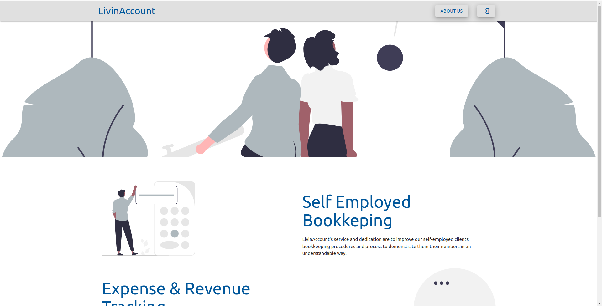
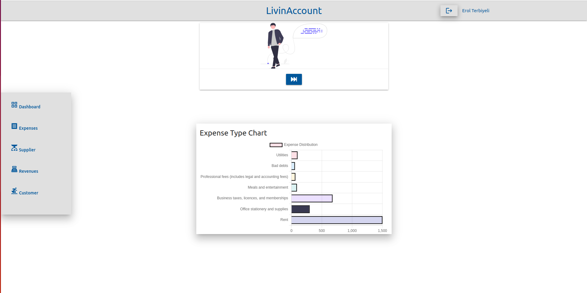
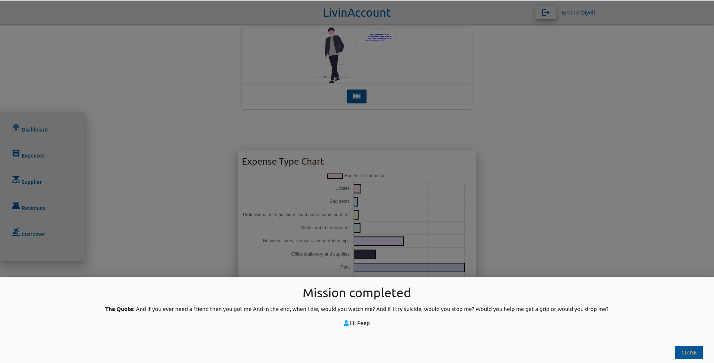
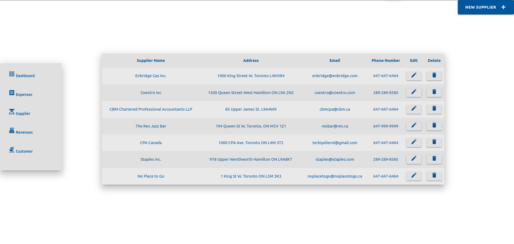
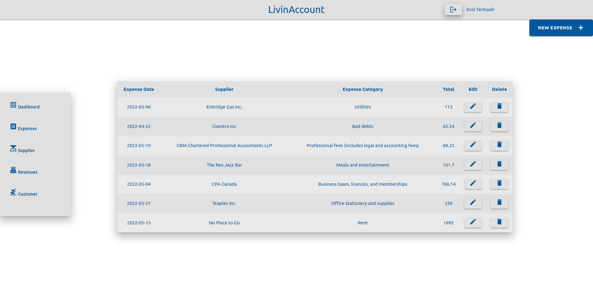

# ⓁⒶ LivinAccount 

Hello and Welcome Everyone

LivinAccount is a self-employed bookkeeping web app that aims to keep every each of records organized.

There are more web app examples outside for the self-employed bookkeeping options;however, LivinAccount will be worth to try

You will be able to create your own suppliers, expenses and you can read a quote from one of the important people in the world

# 🤳 SCREENSHOTS

# 🤖 TECHNOLOGIES USED

- HTML
- CSS
- JavaScript
- Materialize CSS
- JQuery
- Node.js
- Express
- Chart.js
- MongoDB
- OAuth 2.0
- Quotes API
- Heroku

# 🎭 SHOWCASE

<a href="#" target="_blank">LivinAccount</a>

# 🛰 FUTURE OF THE PROJECT

- to play the game with the different screen sizes
- to add new features before starts the game
- to create a board to compare the scores

# CREDITS

<ul>
<li>Background Music supported by <a href="https://en.wikipedia.org/wiki/The_Cinematic_Orchestra">The Cinematic Orchestra</a></li>
<li>Audio Effects:<a href="https://www.zapsplat.com/"> ZapSlat</a></li>
<li>Background Image:<a href="https://www.freepik.com/"> FreePik</a></li>
</ul>